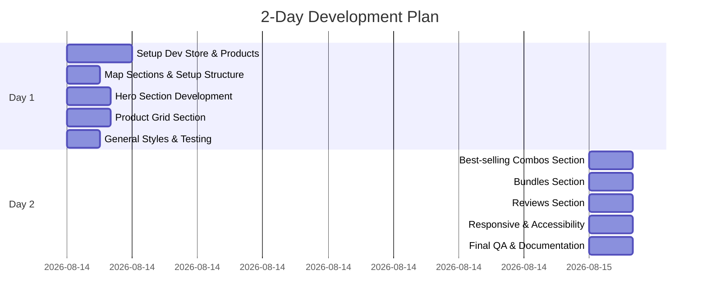
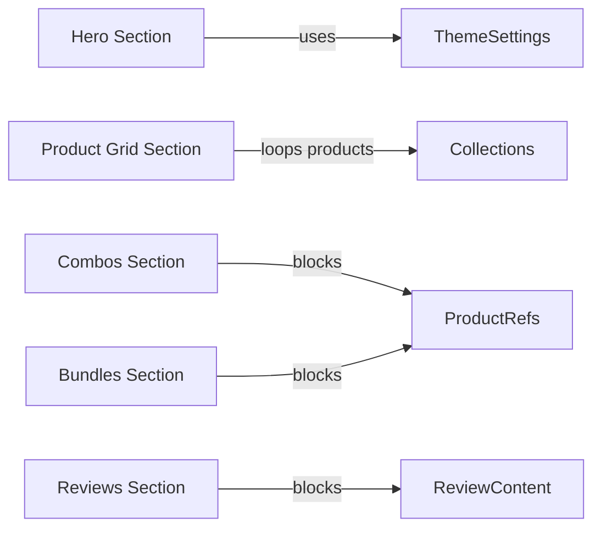

# Troopod Shopify Assignment Plan

**Objective:** Implement the Purelane prototype as a pixel‑accurate Shopify Dawn theme with 5 sections (Hero, Product Grid, Combos, Bundles, Reviews) that meets all Troopod criteria.  

**Acceptance Criteria:**  
- **Shopify Partner Dev Store:** Using a Partner account and a new dev store with Dawn theme installed.  
- **Products:** ≥8 products created in the store, including one **sold-out**, one **no-image**, and one with a **very long title**.  
- **Sections:** Five merchant-editable sections (Hero; Product Grid; Best-selling Combos; Bundles; Reviews) matching the prototype design. Each section must have a JSON/Liquid schema for theme-editor customization.  
- **Real Data:** Sections use real Shopify **product data** (via collections or product picks), *not* hard-coded placeholders.  
- **Responsive:** UI works from **375px (mobile)** up to desktop. Use mobile-first CSS and ensure layout adapts at breakpoints (e.g. mobile, tablet, desktop).  
- **Accessibility:** Semantic HTML, `alt` text on images, proper ARIA labels/roles, sufficient color contrast. Keyboard navigable, screen-reader friendly.  
- **Performance:** Optimize images (lazy-load if needed), minimize CSS/JS, check Core Web Vitals with Lighthouse.  
- **Theme Stability:** Sections can be added/removed/reordered without breaking the page. Clean Git history for submission.  

## Development Plan (2-Day Schedule)

| **Day/Time**      | **Tasks**                                         | **Est. Time** |
|-------------------|---------------------------------------------------|--------------:|
| **Day 1 – Morning**   | - Create Shopify Partner account + new dev store<br>- Install Dawn theme (latest) and set up theme repo in Git<br>- Configure sample data: add 8+ products (include sold-out, no-image, long-title) and any collections. | 3h |
| **Day 1 – Midday**    | - **Map Prototype to Sections:** Break down HTML to define each section’s structure and needed data. (List required settings/blocks per section.)<br>- **Folder Structure Setup:** Create `/sections/`, `/snippets/`, and set up empty `.liquid` files for each section. | 1.5h |
| **Day 1 – Afternoon** | - **Hero Section:** Implement hero.liquid using section schema (image, heading, subheading, CTA button text & link). Ensure full-screen background image and responsive typography. Add Liquid for button URL.<br>- **Product Grid:** Implement product-grid.liquid. Add a setting to choose a collection (or individual products), then loop through `collection.products` to output product cards (use a snippet). Handle sold-out (“Sold Out” label), no-image (hide image or placeholder), long title (CSS ellipsis). | 4h |
| **Day 1 – Late**     | - **General Styles:** Apply basic CSS (Tailwind-like utility or custom CSS) for grid layout, spacing, fonts. Ensure responsiveness (e.g. 1-column mobile, multi-column desktop). Test Hero at mobile vs. desktop. Commit changes. | 1.5h |
| **Day 2 – Morning**  | - **Best-selling Combos:** Create combos.liquid. Decide: each “combo” is a group of products (e.g. 2–3 items) or a single product with bundle info. Simple approach: use **section blocks**, each block has 2–3 product pickers (or one product picker plus variant combos) and a custom image. Loop blocks to display combo “cards”.<br>- **Bundles:** Create bundles.liquid. Similar to combos but perhaps each block has multiple product picks. Include a text field for bundle name/description and image. Layout horizontally scrollable on mobile if many. | 4h |
| **Day 2 – Midday**   | - **Reviews Section:** Create reviews.liquid. Each block = one review. Block fields: reviewer name, avatar image, rating (stars), review text. Loop through blocks to display reviews rail. Add sample reviews. Ensure slider/carousel or grid based on design. | 2h |
| **Day 2 – Afternoon** | - **Refinement:** Responsive tuning (media queries at 375px, 768px, 1024px breakpoints). Accessibility fixes (alt tags, aria-label on buttons). Performance: compress images, remove unused CSS/JS. Test core web vitals (Lighthouse).<br>- **Schema Checks:** Verify each section’s JSON schema allows customizing all prototype content (images, text, products). Ensure theme editor shows controls correctly. | 2h |
| **Day 2 – Late**     | - **Testing & QA:** Verify all requirements:<br>   • Product variants, sold-out label, no-image layout<br>   • Section add/remove/order stability (in theme editor) <br>   • Mobile & desktop pixel accuracy against prototype (use dev tools).<br>- **Documentation:** Write brief build notes and AI usage summary. Prepare submission: store URL/password, Git repo link, metafield definitions (if any). | 2h |



## Tools & Setup

- **Shopify Partner Account:** Create a dev store (e.g. `purelane-demo.myshopify.com`). Record its URL and password for submission.  
- **Dawn Theme:** Fork/download Dawn (latest version). Use Shopify CLI or Theme Kit to work locally, or edit via code editor (VSCode) after fetching theme files.  
- **Version Control:** Initialize a Git repository for the theme. Commit each section/change separately for a clean history.  
- **Products Data:** In the dev store admin, add 8+ products:  
  - **Sold-out product:** Set inventory to 0.  
  - **No-image product:** Leave featured image blank.  
  - **Long title product:** Give a very long name to test wrapping/truncation.  
- **Collections:** (Optional) Create a collection (e.g. "All Products") for the Product Grid section to reference.  
- **AI/Tools:** Use LLMs (GPT/Claude/Codex) as coding assistants (permitted by Troopod). Document any AI-generated code vs. manual edits.

## Sections & Schema Design

Each section has a corresponding **.liquid** file in `/sections/` and a JSON schema block for the editor. Use a consistent naming (e.g. `hero.liquid`, `product-grid.liquid`, `combos.liquid`, `bundles.liquid`, `reviews.liquid`). Create reusable snippets (e.g. `product-card.liquid`, `star-rating.liquid`) for common markup.

### 1. Hero Section (`/sections/hero.liquid`)

**Purpose:** Display a full-width banner with background image, heading, subheading, and CTA button.  

**Schema Settings:**  
```liquid

{
  "name": "Hero Banner",
  "settings": [
    { "type": "image_picker", "id": "bg_image", "label": "Background Image" },
    { "type": "text", "id": "heading",    "label": "Heading Text", "default": "Welcome to Purelane" },
    { "type": "text", "id": "subheading", "label": "Subheading",   "default": "Speed through traffic in style." },
    { "type": "url",  "id": "button_link", "label": "Button Link",  "default": "/collections/all" },
    { "type": "text", "id": "button_text", "label": "Button Text",  "default": "Shop Now" }
  ],
  "presets": [{ "name": "Hero (Full Width)" }]
}

```

**Liquid Outline (snippet):**  
```liquid
<section id="hero" class="hero-section" style="background-image: url({{ section.settings.bg_image | img_url: '2048x2048' }});">
  <div class="hero-content">
    <h1>{{ section.settings.heading }}</h1>
    <p>{{ section.settings.subheading }}</p>
    <a href="{{ section.settings.button_link }}" class="btn btn-primary">{{ section.settings.button_text }}</a>
  </div>
</section>
```
- **Responsive notes:** Use CSS to center content; text size scales. Test for readability on mobile.  
- **Accessibility:** Ensure background image has suitable contrast behind text. If needed, overlay a semi-transparent layer.

### 2. Product Grid Section (`/sections/product-grid.liquid`)

**Purpose:** Show a grid of products (e.g. “Shop” section).  

**Schema Settings:**  
```liquid

{
  "name": "Product Grid",
  "settings": [
    { "type": "collection", "id": "collection", "label": "Product Collection", "default": "" }
  ],
  "presets": [{ "name": "Product Grid" }]
}

```
- Merchant selects a Shopify **collection** (e.g. “All Products”). 

**Liquid Outline (snippet):**  
```liquid
<section id="product-grid" class="product-grid-section">
  <h2>Shop Our Products</h2>
  <div class="grid grid-cols-1 sm:grid-cols-2 md:grid-cols-3 lg:grid-cols-4 gap-6">
    
    
      
    
  </div>
</section>
```
- **Reusable snippet (`/snippets/product-card.liquid`):** Renders one product.
  ```liquid
  <div class="product-card">
    
      <a href="{{ product.url }}">
        
      </a>
    
      <div class="placeholder-image">No image</div>
    
    <h3><a href="{{ product.url }}">{{ product.title | truncate: 50 }}</a></h3>
    
      <p class="price">{{ product.price | money }}</p>
    
      <p class="sold-out">Sold Out</p>
    
  </div>
  ```
- **Features:**  
  - **Sold-out:** Shows “Sold Out” instead of price.  
  - **No-image:** Shows placeholder `div` or hides image.  
  - **Long title:** Use `truncate` or CSS line-clamp to avoid overflow.  
- **Responsive:** Grid switches columns by screen size (example uses Tailwind-style classes). Confirm layout at 375px (mobile: one column) and larger screens (multi-column).  

### 3. Best-selling Combos Section (`/sections/combos.liquid`)

**Purpose:** Showcase curated product combos. Each combo might group 2+ items (as featured product sets).  

**Schema Design:** Use **section blocks** so merchant can add multiple combos. Each block has:  
- **Image:** Optional image for the combo (e.g. lifestyle photo).  
- **Product Picks:** 2–3 product pickers (type `product` in schema).  
- **Text fields:** Combo title/description.  

```liquid

{
  "name": "Best-selling Combos",
  "blocks": [
    {
      "type": "combo",
      "name": "Combo",
      "settings": [
        { "type": "image_picker", "id": "combo_image", "label": "Combo Image" },
        { "type": "product",      "id": "product_1",   "label": "Product #1" },
        { "type": "product",      "id": "product_2",   "label": "Product #2" },
        { "type": "text",         "id": "combo_text",  "label": "Combo Label", "default": "" }
      ]
    }
  ],
  "presets": [{ "name": "Combos Rail" }]
}

```
- **Liquid Outline:**  
  ```liquid
  <section id="best-selling-combos" class="combos-section">
    <h2>Best-selling Combos</h2>
    <div class="combos-container flex overflow-x-auto">
      
        <div class="combo-card">
          
            
          
          <h3>{{ block.settings.combo_text }}</h3>
          <ul class="combo-products">
            
              
              
                <li>
                  <a href="{{ p.url }}">
                    
                    <span>{{ p.title }}</span>
                  </a>
                </li>
              
            
          </ul>
        </div>
      
    </div>
  </section>
  ```
- **Notes:**  
  - Flex container scrolls horizontally on mobile if combos overflow.  
  - Ensure each selected product exists (block may allow empty picks).  
  - Combo text label helps identification (e.g. “Commute Pack”).  

### 4. Bundles Section (`/sections/bundles.liquid`)

**Purpose:** Similar to combos, but possibly highlighting bundle deals. Format like a grid or horizontal scroll of bundle offers.

**Schema Design:** Each block = one bundle. Fields:  
- Bundle image, title, description.  
- Product picks (2–4).  
- Bundle price or “original vs discounted” prices (optional text/number fields).  

```liquid

{
  "name": "Bundles",
  "blocks": [
    {
      "type": "bundle",
      "name": "Bundle",
      "settings": [
        { "type": "image_picker", "id": "bundle_image", "label": "Bundle Image" },
        { "type": "text",         "id": "bundle_title", "label": "Title", "default": "" },
        { "type": "textarea",     "id": "bundle_desc",  "label": "Description", "default": "" },
        { "type": "product",      "id": "product_1",   "label": "Product #1" },
        { "type": "product",      "id": "product_2",   "label": "Product #2" },
        { "type": "product",      "id": "product_3",   "label": "Product #3" }
      ]
    }
  ],
  "presets": [{ "name": "Bundles" }]
}

```
- **Liquid Outline:**  
  ```liquid
  <section id="bundles" class="bundles-section">
    <h2>Bundles</h2>
    <div class="bundles-grid grid grid-cols-1 sm:grid-cols-2 gap-6">
      
        <div class="bundle-card">
          
            
          
          <h3>{{ block.settings.bundle_title }}</h3>
          <p>{{ block.settings.bundle_desc }}</p>
          <ul class="bundle-products">
            
              
              
                <li>
                  <a href="{{ p.url }}">
                    
                    <span>{{ p.title | truncate: 20 }}</span>
                  </a>
                </li>
              
            
          </ul>
        </div>
      
    </div>
  </section>
  ```
- **Notes:**  
  - Grid layout (2 columns on tablet+).  
  - If fewer products picked, blocks still render accordingly.  
  - Could enhance by calculating total price or highlighting savings (beyond scope).

### 5. Reviews Section (`/sections/reviews.liquid`)

**Purpose:** Display customer reviews. Not natively in Shopify, so use static blocks or metaobjects. Here, implement via section blocks.  

**Schema Design:** Each block = one review. Fields: reviewer name, title, rating (text or number), review text, (optional) avatar image.  

```liquid

{
  "name": "Reviews Rail",
  "blocks": [
    {
      "type": "review",
      "name": "Review",
      "settings": [
        { "type": "text",  "id": "reviewer", "label": "Reviewer Name" },
        { "type": "text",  "id": "rating",   "label": "Rating (1-5)" },
        { "type": "textarea", "id": "text",   "label": "Review Text" },
        { "type": "image_picker", "id": "avatar", "label": "Avatar Image" }
      ]
    }
  ],
  "presets": [{ "name": "Reviews Rail" }]
}

```
- **Liquid Outline:**  
  ```liquid
  <section id="reviews" class="reviews-section">
    <h2>Customer Reviews</h2>
    <div class="reviews-container flex overflow-x-auto">
      
        <div class="review-card">
          
            
          
          <h4>{{ block.settings.reviewer }}</h4>
          <p class="rating">★</p>
          <p class="review-text">{{ block.settings.text }}</p>
        </div>
      
    </div>
  </section>
  ```
- **Notes:**  
  - Display stars equal to the rating number.  
  - Ensure text wraps nicely.  
  - If no avatar, design should not break (optional image).  

## Code Snippets & Schema Examples

- **Example product-card snippet (Liquid):**  

  ```liquid
   /snippets/product-card.liquid 
  <div class="product-card">
    
      <a href="{{ product.url }}">
        
      </a>
    
      <div class="no-image">No Image Available</div>
    
    <h3>
      <a href="{{ product.url }}">{{ product.title | truncate: 40 }}</a>
    </h3>
    
      <p class="price">{{ product.price | money }}</p>
    
      <p class="sold-out">Sold Out</p>
    
  </div>
  ```
  
- **Theme-editor schema example (Hero section JSON):**  

  ```json
  {
    "name": "Hero Banner",
    "settings": [
      { "type": "image_picker", "id": "bg_image", "label": "Background Image" },
      { "type": "text", "id": "heading", "label": "Heading", "default": "" },
      { "type": "text", "id": "subheading", "label": "Subheading", "default": "" },
      { "type": "url", "id": "button_link", "label": "Button Link", "default": "" },
      { "type": "text", "id": "button_text", "label": "Button Text", "default": "Shop Now" }
    ],
    "presets": [{ "name": "Hero (Full Width)" }]
  }
  ```

- **Decision on Metaobjects vs. Schema:** For this project, static sections with blocks suffice. In a larger store, one might use [Shopify Metaobjects](https://shopify.dev/docs/admin-api/rest/reference/online-store/metaobject) to manage reviews or combos centrally, but the assignment scope allows direct schema usage.

## Component Diagram



## Testing & QA Checklist

- **Responsive Layout:**  
  - Verify each section at **mobile (375px)**, tablet (768px), and desktop breakpoints. Adjust CSS as needed.  
  - Check grid/stack behavior, image scaling, text size.  

- **Accessibility:**  
  - All `` tags have meaningful `alt` (fallback to product title).  
  - Ensure clickable elements (buttons/links) are keyboard-focusable.  
  - Use semantic tags (`<section>`, `<h2>`–`<h4>`, etc.).  
  - Color contrast ratio meets WCAG AA (test with a tool).  
  - Form controls/links have ARIA labels if needed (e.g., if using `<div role="button">`, which we avoid here).  

- **Functionality:**  
  - **Theme Editor:** Add/remove each section, reorder them. Ensure no console errors or styling breaks.  
  - **Product Logic:** Confirm sold-out product shows “Sold Out” label; no-image product does not show a broken image. Long titles are truncated or wrap correctly.  
  - **Data Binding:** Changing collection or product picks in the editor updates the display.  

- **Performance (Core Web Vitals):**  
  - Lazy-load below-the-fold images if many (Shopify by default lazy-loads images).  
  - Minimize CSS & JS: use only what Dawn provides, avoid heavy libraries.  
  - Optimize images to appropriate sizes (use Shopify image resizing filters as above).  
  - Run Lighthouse audit to check metrics (LCP, FID, CLS). Aim for minimal issues.  

- **Edge Cases:**  
  - **Empty Blocks:** If a section block is added without filling all product picks, ensure UI doesn’t break. Possibly hide blank entries.  
  - **Long Review Text:** In Reviews, long text should wrap; consider max-height with overflow or allow multi-line.  
  - **Bundles with 1 Product:** Ensure layout doesn’t break if only one product is selected.  

## Deployment & Submission

- **Dev Store URL & Password:** After completion, provide the dev store link (e.g. `https://purelane-demo.myshopify.com`) and its login password. Troopod will use this to review the live store and theme.  
- **GitHub Repository:** Push the Dawn theme with custom sections/snippets to a public GitHub repo. Include a clear README with setup instructions (e.g. “place these section files under /sections in Dawn”).  
- **Metafields/Metaobjects:** If any custom data (none required here), document schema. Likely not needed beyond section schemas.  
- **Build Notes (Document):** A brief summary of what was built, any assumptions made, and how the sections map to the prototype.  
- **AI Workflow Notes:** Outline how AI tools were used (e.g. “Generated initial JSON schema with ChatGPT, adjusted layout manually”, “Used AI to suggest responsive CSS, verified and corrected for pixel precision”). Mention any AI inaccuracies and how they were corrected.  

## Deliverables Checklist

- Shopify **dev store** live URL & password (for review).  
- **GitHub repo** URL containing the customized Dawn theme (with commits).  
- **Sections:** `hero.liquid`, `product-grid.liquid`, `combos.liquid`, `bundles.liquid`, `reviews.liquid` (in `/sections`).  
- **Snippets:** e.g. `product-card.liquid`, `star-rating.liquid` (if used).  
- **Config Files:** `config/settings_schema.json` updated if needed; ensure sections appear in theme editor.  
- **Documentation:** One-page markdown or PDF with build notes & AI usage summary.  
- **Preview Diagrams:** (Optional) In lieu of actual screenshots, you may include diagrams of the layout. For example, a simple mockup:
  ```mermaid
  graph TD
    A[Hero Image] --> B[Heading & CTA]
    C[Product Grid] -->|shows| D[Product Cards]
    E[Combos] -->|blocks| F[Combo Cards]
    G[Bundles] -->|blocks| H[Bundle Cards]
    I[Reviews] -->|blocks| J[Review Cards]
  ```
  (Alternatively, attach actual screenshots of the theme in action if possible.)  

## Summary

This plan turns the Troopod assignment into a step-by-step development roadmap. It covers setting up the Shopify dev store, breaking down the prototype HTML into distinct Shopify sections, designing section schemas for merchant editing, and building each section with real product data. The schedule allocates about 2 days of work, balancing feature development with testing and documentation. Key focus areas are **pixel-accurate implementation**, **clean Shopify/Liquid coding**, and **full editorial control** via section settings – exactly as Troopod expects. Testing (responsive, accessibility, performance) and clear submission deliverables (store link, repo, notes) ensure the final product meets all requirements. 

Overall, this detailed plan should allow an LLM or developer to execute the assignment systematically and verify completion against Troopod’s criteria.